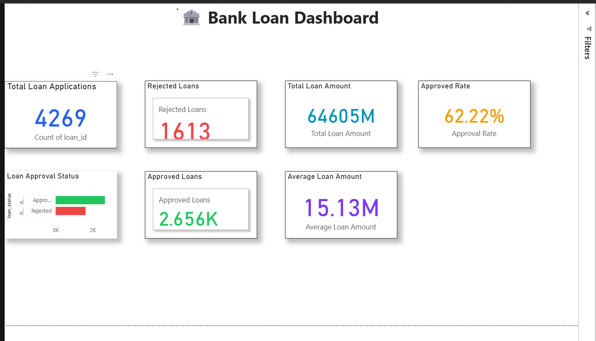
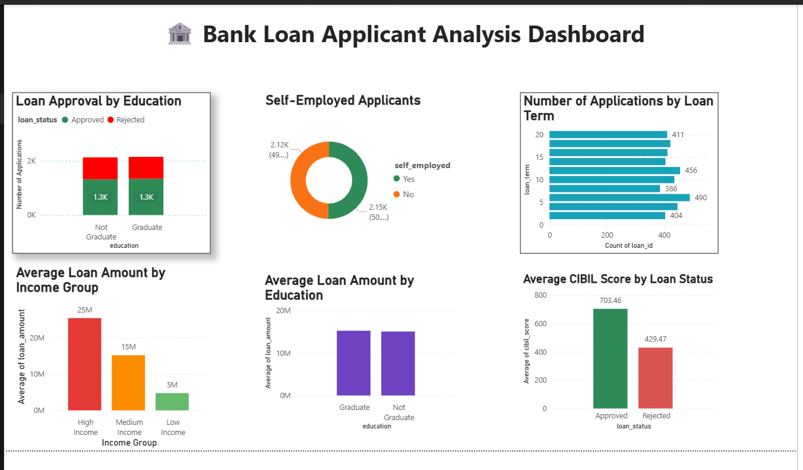

# 🏦 Bank Loan Approval Dashboard | Power BI

## 📌 Project Overview

The Bank Loan Approval Dashboard is an interactive Power BI project developed to analyze loan application data and provide meaningful business insights. The dashboard presents customer demographics, loan approval patterns, financial trends, and key performance indicators through clear and interactive visualizations.

This project demonstrates how Power BI can transform raw data into actionable insights for business decision-making.

## 🎯 Project Objectives

- Analyze loan application and approval trends.
- Understand customer demographics and financial profiles.
- Monitor key loan performance metrics.
- Create an interactive dashboard for data exploration.
- Support data-driven decision-making through visual analytics.

## 📊 Dashboard Features

### Page 1 – Executive Dashboard
- Loan application summary
- Approved and rejected loan analysis
- Loan amount overview
- Customer demographic insights
- Interactive KPI cards and slicers

### Page 2 – Detailed Analysis
- Loan approval trends
- Income and loan amount distribution
- Customer segmentation
- Interactive charts and filters

 🛠️ Tools & Technologies

- Microsoft Power BI
- Power Query
- DAX (Data Analysis Expressions)
- CSV Dataset
- Data Modeling
- Data Visualization

## 📸 Dashboard Preview

### Executive Dashboard

### Detailed Analysis

## 💼 Skills Demonstrated

- Data Cleaning and Transformation
- Data Modeling
- DAX Calculations and Measures
- Interactive Dashboard Design
- KPI Development
- Business Intelligence Reporting
- Data Visualization
- Filter and Slicer Implementation

---

## 📂 Repository Contents

| File | Description |
|------|-------------|
| `BANK PROJECT.pbix` | Power BI project file |
| `loan_approval_dataset.csv` | Dataset used for analysis |
| `Dashboard_Page1.png` | Executive dashboard preview |
| `Dashboard_Page2.png` | Detailed dashboard preview |

---

## 📈 Business Value

This dashboard enables users to analyze loan approval trends, evaluate customer characteristics, and monitor key lending metrics. The interactive design makes it easier to identify patterns and supports informed business decisions.

## 🚀 How to Use

1. Download or clone this repository.
2. Open `BANK PROJECT.pbix` in Microsoft Power BI Desktop.
3. If prompted, reconnect the `loan_approval_dataset.csv` file.
4. Explore the dashboard using the available filters and slicers.

## 👨‍💻 Author

**Muhammad Ibrahim**

Bachelor of Data Science

Interested in Data Analytics, Business Intelligence, and Power BI Development.
